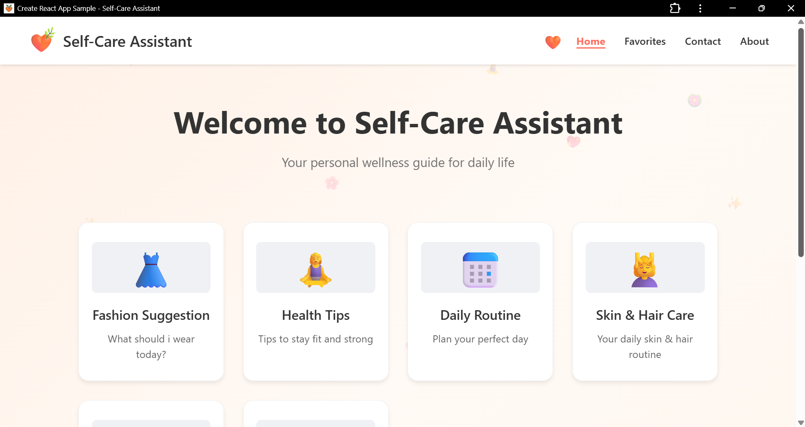

# **📌 Self-Care Assistant — Full Stack Wellness App**

A simple, clean, and smart **self-care and wellness assistant** built using **React (Frontend)** and **Node.js + Express + MongoDB + Gemini AI (Backend)**.

It helps users maintain their daily routine, get fashion and skincare suggestions, stay motivated, and manage tasks easily.

---

## 🌿 **Features**

* 🧼 **Skin & Hair Care Tips**
* 👗 **Fashion Suggestions**
* 🧘 **Daily Routine Planner**
* 🏋️ **Health Tips**
* 📝 **To-Do List**
* ⏰ **Smart Reminders**
* 💬 **Contact Form with Backend API**
* 🤖 **Gemini AI Integration**
* ✨ **Motivational Quotes Section**
* 🎨 **Clean & Aesthetic UI**

---

## 🗂 **Project Structure**

```
Self-Care-Assistant/
│
├── backend/
│   ├── middleware/
│   ├── models/
│   ├── routes/
│   ├── geminiService.js
│   ├── server.js
│   ├── .env
│
└── frontend/
    ├── src/
    │   ├── components/
    │   │   ├── Admin/
    │   │   ├── Footer/
    │   │   ├── Header/
    │   │   ├── Hero/
    │   │   ├── QuoteBox/
    │   │   ├── ServiceCards/
    │   │   └── Services/
    │   ├── App.js
    │   ├── index.js
    │   ├── Background.css
    │   └── App.css
```

---

## 🚀 **Tech Stack**

### **Frontend**

* React.js
* React Router
* CSS
* Lucide Icons
* Axios

### **Backend**

* Node.js
* Express.js
* MongoDB + Mongoose
* Gemini AI API
* dotenv

---

## ⚙️ **How to Run Locally**

### 🔹 **Backend**

```bash
cd backend
npm install
npm start
```

Add `.env`:

```
MONGO_URI=your_mongodb_url
GEMINI_API_KEY=your_api_key
```

---

### 🔹 **Frontend**

```bash
cd frontend
npm install
npm start
```

---

## 📸 **UI Preview**


```

---

## 📬 **Contact**

For queries or feedback, contact:
📧 **your email**
📱 **your phone (if you want)**

---

## ⭐ **Star this repo**

If you like this project, don’t forget to star the repository!
